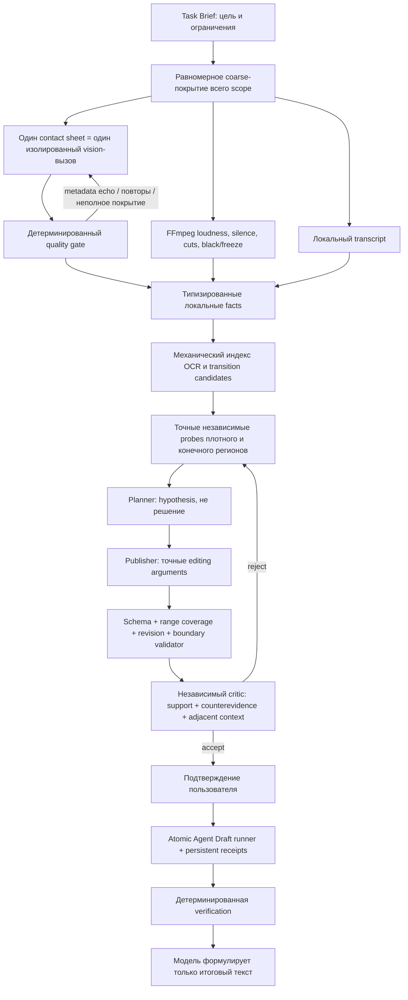

# Аудит content-discovery монтажного агента

## Подтверждённая причина ошибочного решения

В ошибочном прогоне planner получил не просто слабое мнение модели, а внутренне
противоречивые sensor facts. Контактные листы нескольких временных окон были
отправлены vision-модели одним multimodal-запросом. Текст запроса одновременно
содержал абсолютные диапазоны и формулу временной сетки. В результате модель:

1. переносила описание одного изображения на соседние контактные листы;
2. копировала служебный диапазон prompt в `visible_text`, как будто это OCR кадра;
3. повторяла производственные титры поверх фактически меняющегося сюжетного окна;
4. возвращала правильный общий текст вроде «основной сюжет», но загрязнённый массив
   `observations` оставался типизированным успешным evidence.

Дальше ошибка усиливалась детерминированным кодом: OCR-indexer доверял каждой строке
успешного evidence, объединял удалённые факты с допуском 75 секунд и создавал один
ложный широкий регион. Planner получал десятки тысяч символов дублированного и
противоречивого контекста без обязательного разделения fact/hypothesis/decision.

Это подтверждено сравнением реальных окон одного файла:

- старый подробный проход `147.858–327.858` повторял почти одинаковые кадры и титры;
- новый независимый проход `237.857–356.786` видит город, класс, доску, коридор и
  разных персонажей, то есть фактическую смену сюжетных кадров;
- на изображениях контактных листов нет временных надписей, поэтому прежний диапазон
  в OCR мог появиться только из metadata prompt.

## Новый конвейер

## Непротиворечивые правила фаз

| Фаза | Что может модель | Что запрещено | Кто принимает решение |
|---|---|---|---|
| Task Brief | нормализовать намерение | придумывать контент/таймкоды | schema + workflow |
| Sensor | описать измеренное в одном локальном окне | видеть task query, классифицировать блок, решать монтаж | quality gate |
| Planner | предложить смысловую гипотезу | считать OCR/cut/тишину готовым решением | plan validator |
| Critic | независимо искать поддержку и контрдоказательства | исправлять план, вызывать tools | critic + deterministic prerequisites |
| Execution | — | любые model-selected edits | approved-plan runner |
| Verification | сформулировать отчёт | менять `IsValid`, скрыто исправлять draft | deterministic engine |

Основной инвариант: `user request → sensor fact → planner hypothesis → approved edit`
являются разными сущностями. Ни один следующий уровень не может быть записан в поле
предыдущего.

## Реализованные ограничения

- Vision не получает имя файла, задачу, абсолютные таймкоды или соседние листы.
- Каждый tile обязан иметь отдельное описание; таймкоды добавляет приложение после
  ответа модели.
- Metadata echo, неполный массив tiles и подозрительное точное повторение на технически
  меняющемся диапазоне отклоняют всё наблюдение; частичный успех не публикуется.
- OCR-регион разрывается после 18 секунд без наблюдаемого текста; граница конца
  вычисляется из локального шага sampling, а не фиксированным `+20s`.
- Длинный обзор сжимается равномерно по каждому временному окну; начало не может
  вытеснить конец из context budget.
- Один факт не передаётся одновременно большим raw JSON и дублированным summary.
- Для content discovery доступные frames/audio/transcript нельзя выборочно понизить;
  `all` требует все три канала по всей площади удаляемого диапазона.
- Внутренние координаты удаления обязаны совпасть с точными успешными boundary probes.
- Critic для каждого editing step отдельно подтверждает action support, точность
  аргументов, отсутствие protected content, проверку контрдоказательств, соседнего
  контекста и отсутствие неразрешённых противоречий.
- Немое видео использует frames; при наличии аудио выполняются loudness measurements;
  временный сбой transcript не превращает универсальный агент в неработоспособный.

## Оставшиеся физические ограничения

Sparse contact sheets не являются просмотром каждого видеокадра. Поэтому они дают
равномерное покрытие representative samples, а точные координаты всё равно требуют
узких boundary probes. OCR vision-модели может ошибаться в отдельных символах; смысл
текста должен подтверждаться повторяемой структурой, кадрами, звуком и transcript, а
не одной строкой. Эти ограничения явно передаются planner-у и critic-у и не маскируются
словом `coverage_complete`.
